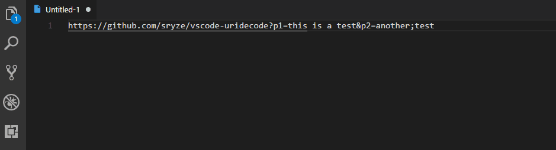

# URI Encode/Decode

This is a simple extension that encodes or decodes a piece of text as a URI (URL).

## Features

* Select a URI and open command palette -> `Encode as URI` or `Decode as URI` to encode/decode it
  as a whole URI. This ensures that only the necessary parts are encoded, i.e. query parameters.

* Select a part of a URI and open command palette -> `Encode as URI Component` or 
  `Decode as URI Component` to encode/decode as a URI parameter. 
  
  Usually you only want to use this if you select the value of some parameter after the `=` sign 
  and you want to encode/decode only that part.

## Release Notes

### 0.3.3

Added an icon

### 0.3.2

Various documentation fixes

### 0.3.1

Fixed another typo in README

### 0.3

* Refactored code
* Added a GIF to demonstrate how it works

### 0.2

Added `Encode as URI` and `Decode as URI` commands

### 0.1

Fixed a typo in README

### 0.0.1

Initial release
